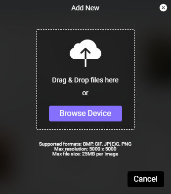
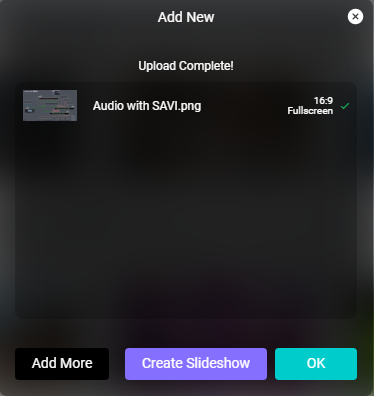
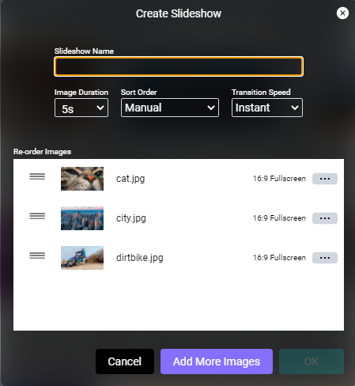

# Adding Images And Slideshows

Images are what show is all about! Media in SAVI Show will immediately become available in Facility View and Creator.

#### Adding A New Image

1. Start by selecting **Add New** 

2. Select **Browse Device**

3. Navigate to the images on your device and select one or more
    >***Only BMP, GIF, JP(E)G, PNG supported. Images must be smaller than 3840x2160 resolution and no larger than 25MB per image. Check out our [resource](/Knowledge-Base/User-Interface/SAVI-Show/digital-signage-best-practices.md) for other image guidelines.***

4. Click **Open**. The images will be uploaded, and you will be shown a summary of the files.
5. Select **OK** to return to the main Show screen, **Add More** to upload more images, or **Create Slideshow** to collect your images into a slideshow.

#### Creating A New Slideshow

1. Start by selecting multiple images in Show or by uploading multiple images

2. Click **Create Slideshow** in the **Topbar** or in the **Add New** modal to show the **Create Slideshow** modal above

3. Name the slideshow and configure its settings
    * **Image Duration:** Choose how long an image shows before transitioning to the next image.
    * **Sort Order:** Set to Manual, Alphabetical, or Random.
    * **Transition Speed:** Set if there is a fade transition and how long it lasts.

4. Drag and drop to reorder images for Manual Sort Order
    >Delete unwanted images by selecting the ellipsis menu and **Delete Item**.

5. Click **Add More** Images to select additional images or click **OK** to create the slideshow

Slideshows are found at the bottom of the image pane, below images. Selecting Slideshows from the Type in the Sidebar will show only slideshows, allowing for quick discovery without the need to scroll past images.
