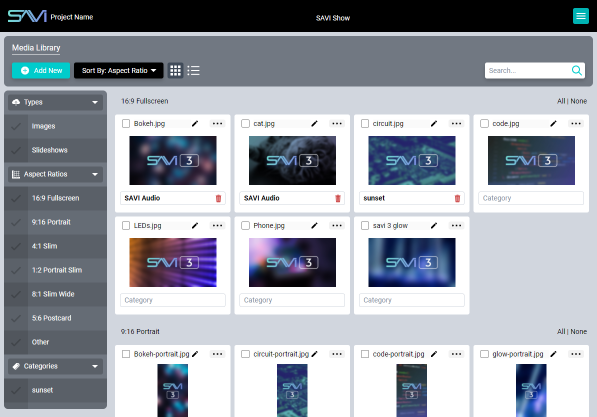
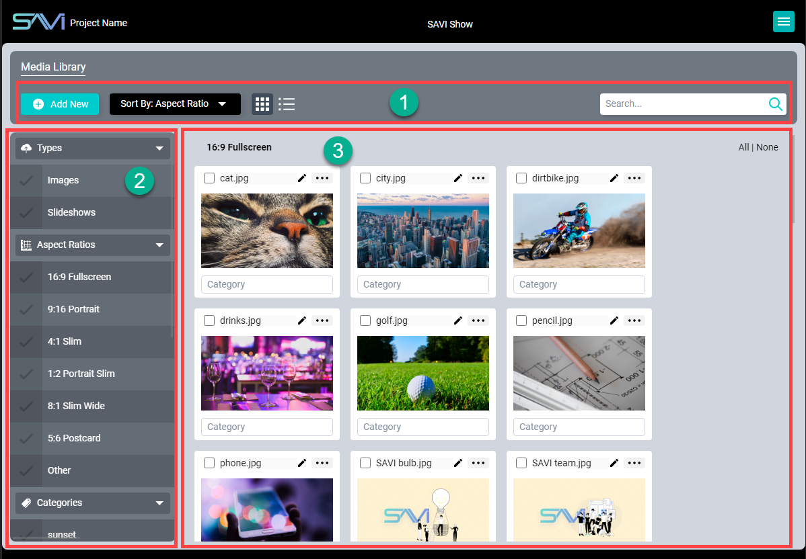
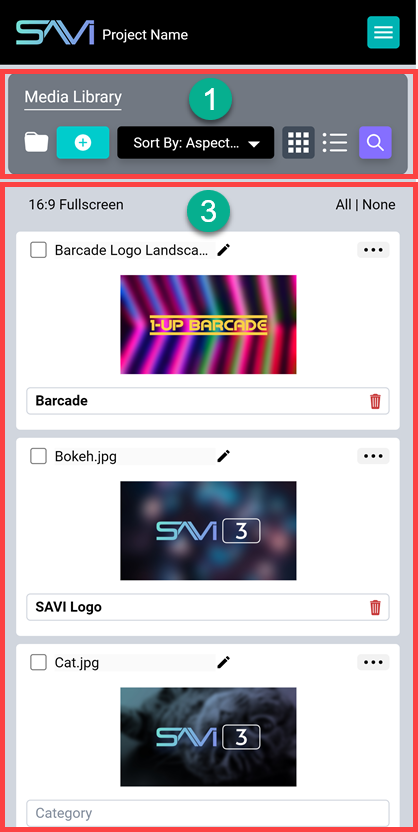
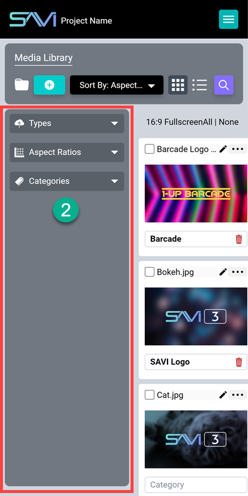

# Getting Started With Show

## Requirements
As Show is pre-packaged with SAVI 3, you must have a SAVI Server installed and connected to your network to access Show. SAVI 3 itself does not require internet access, but it does require connection to a local network for access to the User Interface. It also requires any device with access to a modern internet browser, such as a phone, tablet, laptop, or desktop.

## Initial Login
Welcome to SAVI Show!

The entirety of the SAVI 3 UI is accessible through any modern browser by navigating to the correct IP address and entering a valid Username and Password. SAVI Server.Pro is set to a default Static IP address:

>`10.192.168.1`

To reach Show for your setup, append "/savi-show" (without quotes) to the end of the SAVI 3 IP address. It should look like this:

>`10.192.168.1/savi-show`

If you are not logged into Facility View already, you will be greeted with the login window pictured below. Your credentials are the same as Facility View. If a guest account is created for Facility View, login credentials will still be needed for Show.

## Interface

SAVI Show allows end-users to deliver content to any display in a matter of seconds. No need to call an integrator to program this capability, send an image, log into a platform, or a truck roll. End-users can create ‘Happy Birthday’ graphics, display daily specials, or even sell marketing space on their displays; all without calling their integrator. SAVI Show puts content management in the hands of your end-users!

Simply upload a new image and link directly to it in Facility View.

SAVI Show’s interface is divided into three main areas. Looking at our example above, these are:
1. **Topbar:** (on the top) Add and sort options on the left with a Search bar on the right. The Search bar is replaced by a Delete button when selecting images.
2. **Sidebar:** (on the left) This displays the collapsible groups (Types, Aspect Ratios, and Categories) that images are filtered by. On mobile, this is accessible by selecting the **folder icon** on the left side of the Topbar.
3. **Image Pane:** (on the right) The light gray pane displays uploaded media and created slideshows.

Use the Sidebar to help filter content, selecting one or more options to limit what is viewable in the Image Pane.
