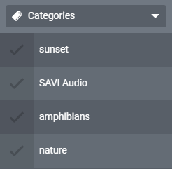
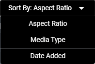
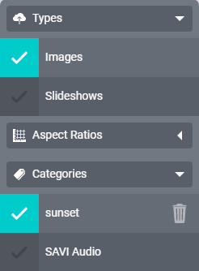
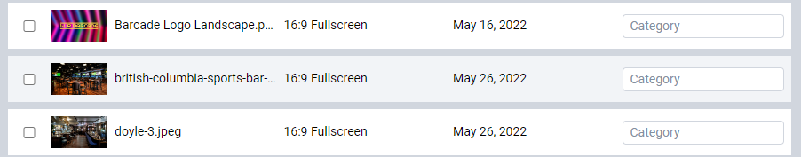
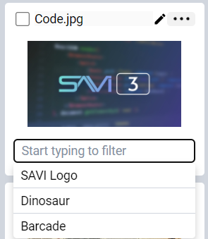
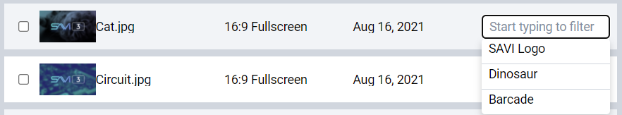
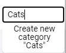
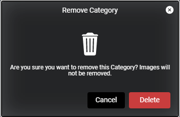

# Managing Images And Slideshows

SAVI Show has a variety of ways to manage your media. The search bar in the top right will dynamically filter to show only what matches your text as you type. The convenient **ALL | None** selectors at the top right of each group of media will allow easy selecting or deselecting of all media in that group. There’s sorting, filtering, view types, and even custom categories!

## Sorting

There are three sort options in Show:
* **Aspect Ratio:** The width of an image in relation to its height (16:9 Fullscreen, 9:16 Portrait, etc.,).
* **Media Type:** This separates images and slideshows.
* **Date Added:** Sorts by the date the images or slideshows were added to Show. Does not separate media types.

## Filtering

To filter media, select one or more options from the Sidebar. These can be from the same group or multiple groups. Each selection will remove the unselected options from the Image Pane, showing only the media you want to see.

## Views

There are two main views for Show:
* **Tile view:** Shows media as large thumbnails for easy browsing. This is set by default.
* **List view:** This view displays more information about each piece of media. The name, aspect ratio, date added, and category are all listed out in easy to read columns.

## Deleting

Deleting media is as simple as selecting what you want to remove, then hitting the big red **Permanently Delete** button.

>***WARNING: Permanently Delete completely removes media and is not reversible.***

## Replacing An Image

1. Select the one you wish to replace (only one image can be replaced at a time) and click **Replace Image**

2. Navigate to the new image on your device, select it, and click **Open**

## Adding A Category

1. Click the **Category** field, either under the image in tile view or to the right in list view

2. Select an existing Category or type a new one

3. If typing a new category, press **Enter** or select **Create New Category** in the dropdown

## Removing A Category

To remove a Category from an image or slideshow, simply click the red **trashcan icon** in the Category field.

To fully delete the Category from the Sidebar and all such tagged media, simply click the **trashcan icon** to the right of the Category name, then click **Delete** in the modal.
